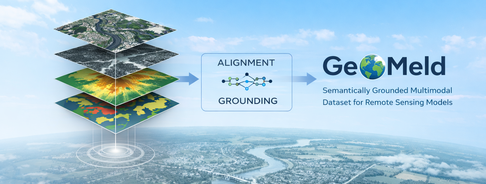
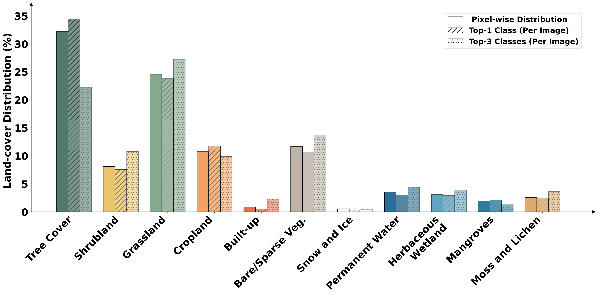
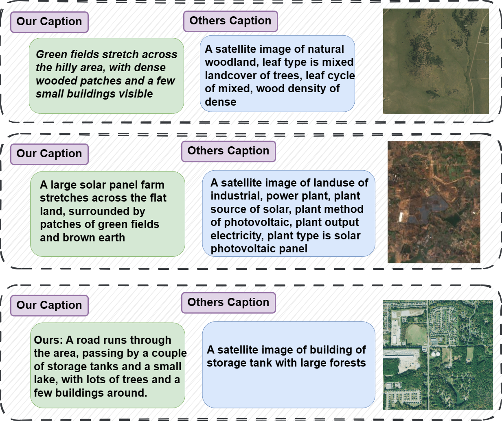
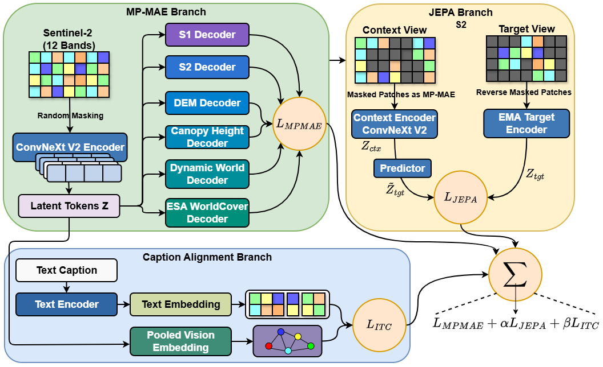

<p align="center">
  
</p>
<h1 align="center">
GeoMeld: Toward Semantically Grounded Foundation Models for Remote Sensing
</h1>

<p align="center">
<span style="display:inline-block; width:120px; height:5px; background:#f4a261;"></span>
<span style="display:inline-block; width:120px; height:5px; background:#e76f51;"></span>
<span style="display:inline-block; width:120px; height:5px; background:#e63946;"></span>
<span style="display:inline-block; width:120px; height:5px; background:#9d4edd;"></span>
<span style="display:inline-block; width:120px; height:5px; background:#4cc9f0;"></span>
</p>

<p align="center">
<a href="https://github.com/MaramAI/GeoMeld">Maram Hasan</a>, 
<a href="https://github.com/MaramAI/GeoMeld">Md. Aminur Hossain</a>, 
<a href="https://github.com/MaramAI/GeoMeld">Savitra Roy</a>, 
<a href="https://github.com/MaramAI/GeoMeld">Souparna Bhowmik</a>, 
<a href="https://github.com/MaramAI/GeoMeld">Ayush V. Patel</a>,<br>
<a href="https://github.com/MaramAI/GeoMeld">Mainak Singha</a>, 
<a href="https://github.com/MaramAI/GeoMeld">Subhasis Chaudhuri</a>, 
<a href="https://github.com/MaramAI/GeoMeld">Muhammad Haris Khan</a>, 
<a href="https://github.com/MaramAI/GeoMeld">Biplab Banerjee</a>
</p>

<p align="center">
<b>
Indian Institute of Technology Bombay, &nbsp;&nbsp; &nbsp;&nbsp;
Space Applications Centre, ISRO, <br>
University of Trento, &nbsp;&nbsp; &nbsp;&nbsp;
Mohamed bin Zayed University of Artificial Intelligence
</b>
</p>


<p align="center">
<a href="https://arxiv.org/abs/2604.10591"></a>
<a href="https://huggingface.co/datasets/vimageiitb/GeoMeld"></a>
<a href="#"></a>
</p> 
  

## 📊 GeoMeld Overview

GeoMeld is a large-scale multimodal remote sensing dataset for semantically grounded foundation modeling. It contains approximately 2.5 million spatially aligned samples spanning optical imagery, SAR, elevation, canopy height, land-cover products, and geographic metadata, paired with semantically grounded captions generated through an agentic captioning framework.

The dataset is designed to support:
- multimodal representation learning
- vision-language pretraining
- cross-modal retrieval
- downstream classification and segmentation
- semantically grounded remote sensing foundation models


## 🧩 News
- [x] GeoMeld accepted at CVPR MORSE Workshop 2026 🎉
- [x] Dataset release


## 🌍 Highlights

- Large-scale multimodal dataset (~2.5M samples) with spatial and temporal alignment
- Semantically grounded captions generated via an agentic multi-stage pipeline
- Integration of heterogeneous modalities: o Sentinel-2, Sentinel-1, NAIP, ASTER-DEM, canopy height, ESA WorldCover, Dynamic World, metadata 
- GeoMeld-FM: unified pretraining framework combining MP-MAE, JEPA, and contrastive alignment
  
<p align="center">
  
  
</p>


## 🖼️ Dataset Contents

Each sample may include:
- Sentinel-2 optical imagery
- Sentinel-1 SAR
- high-resolution NAIP imagery (when available)
- ASTER-derived elevation
- canopy height
- ESA WorldCover
- Dynamic World
- metadata
- caption
<p align="center">
  
</p>
GeoMeld is constructed using geographic anchors derived from existing datasets, including MMEarth and SkyScript, as well as a custom sampling strategy.

See [dataset card](docs/dataset_card.md) for full details.

## 🤖 Caption Generation Pipeline

Captions are generated using a multi-agent framework:

1. Orchestrator: extracts structured signals (land-cover, metadata, OSM)
2. Captioner: generates multiple candidate captions
3. Evaluator: ranks captions via vision–text alignment
4. Verification: enforces consistency with geospatial signals

This design ensures semantically grounded and physically consistent captions.
<p align="center">
  
</p>

See [dataset card](docs/dataset_card.md) for more details.


## 🚀 GeoMeld-FM Pretraining

We introduce a unified pretraining framework combining:

- Multi-pretext masked autoencoding (MP-MAE)
- JEPA-style predictive representation learning
- Caption–vision contrastive alignment

The objective enables learning representations that capture:
- cross-sensor physical consistency
- semantically grounded concepts

<p align="center">
  
</p>

### 📊 GeoBench Evaluation

| Pretrain Data | BigEarthNet (FT / LP) | So2Sat (FT / LP) | Cashew1K (FT) | Sacrop3K (FT) |
|---|---|---|---|---|
| ImageNet | 55.7 / 25.9 | 36.6 / 24.0 | 77.1 | 26.7 |
| MMEarth (MP-MAE) | 67.1 / 43.3 | 54.6 / 43.8 | 79.8 | 38.2 |
| GeoMeld-S2 | 66.8 / 38.3 | 50.8 / 35.6 | 80.8 | 37.5 |
| **GeoMeld-FM (Full)** | **71.8 / 49.6** | **59.8 / 50.2** | **83.2** | **42.7** |

### 🧪 Ablation Study

| Variant | MP | JEPA | ITC | BE (LP) | S2 (LP) | C1K (FT) | S3K (FT) | R@5 (I→T / T→I) |
|---|---|---|---|---|---|---|---|---|
| S2-MAE baseline | ✗ | ✗ | ✗ | 38.3 | 35.6 | 80.8 | 37.5 | – |
| + MP-MAE | ✓ | ✗ | ✗ | 44.8 | 45.2 | 81.3 | 39.6 | – |
| + MP-MAE + JEPA | ✓ | ✓ | ✗ | 46.1 | 46.9 | 82.4 | 40.8 | – |
| + MP-MAE + ITC | ✓ | ✗ | ✓ | 45.4 | 45.8 | 81.9 | 40.1 | 31.4 / 33.8 |
| **GeoMeld-FM (Full)** | ✓ | ✓ | ✓ | **49.6** | **50.2** | **83.2** | **42.7** | **37.8 / 39.6** |

## 📥 Download

See [Download page](docs/Download.md) for full details.

## 📚 Citation
```bash

@article{hasan2026geomeld,
  title={GeoMeld: Toward Semantically Grounded Foundation Models for Remote Sensing},
  author={Hasan, Maram and Hossain, Md Aminur and Roy, Savitra and Bhowmik, Souparna and Patel, Ayush V and Singha, Mainak and Chaudhuri, Subhasis and Khan, Muhammad Haris and Banerjee, Biplab},
  journal={arXiv preprint arXiv:2604.10591},
  year={2026}
}
```
